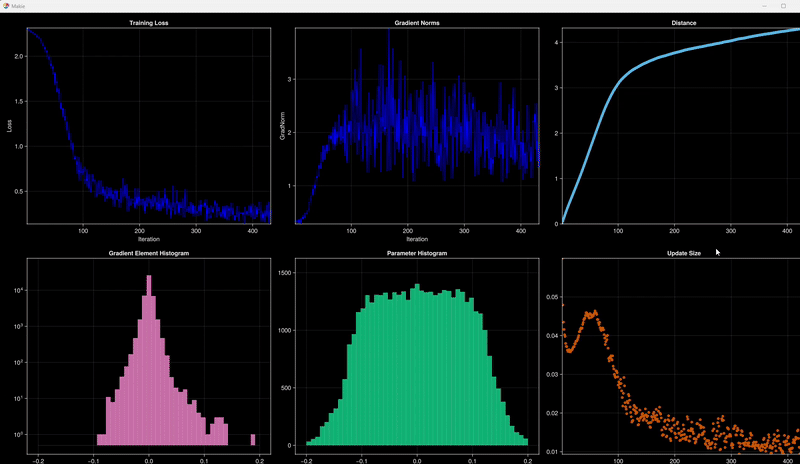

# JL_Cockpit

The JL_Cockpit module is a Julia reimplementation of the cockpit python module.
This module is being developed as part of the 'Julia for Machine Learning' course at Technische Universität Berlin.

cockpit repository: [https://github.com/f-dangel/cockpit](https://github.com/f-dangel/cockpit)

cockpit documentation: [https://cockpit.readthedocs.io/en/latest/examples/01_basic_fmnist.html](https://cockpit.readthedocs.io/en/latest/examples/01_basic_fmnist.html)

cockpit paper: [https://arxiv.org/abs/2102.06604](https://arxiv.org/abs/2102.06604)

